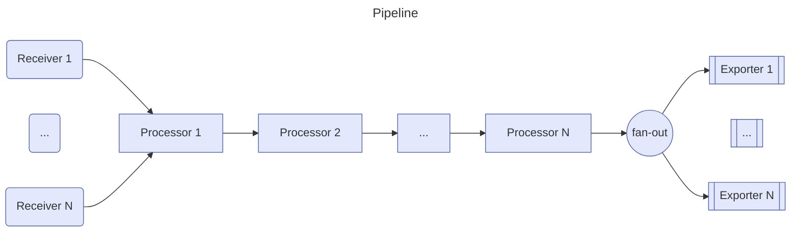

# Exporter des logs vers un backend OpenTelemetry

<Onea class="absolute left-10 bottom-5"/>

<!--
Au coeur de l'observabilité.
-->

---
transition: fade-out
---

# Exporter des logs vers un backend OpenTelemetry

<Toc columns="1" min-depth="2" max-depth="3" mode="onlySiblings" />


---
transition: fade-out
layout: image-right
image: /images/logs-without-opentelemetry.png
backgroundSize: contain
title: Les Logs
level: 2
---
# Sans OpenTelemetry
<p class="absolute right-5 top-3 text-3xl"> Les Logs </p>

- Faible intégration avec les traces et métriques
- Manque de standardisation pour inclure les informations sur l'origine des logs
- Absence de propagation du contexte d'exécution

<Onea class="absolute left-10 bottom-5"/>

---
transition: fade-out
layout: image-right
image: /images/logs-with-opentelemetry.png
backgroundSize: contain
level: 3
---
# Avec OpenTelemetry
<p class="absolute right-5 top-3 text-3xl"> Les Logs </p>

- Standardisation de la corrélation des logs avec les traces et métriques
- Ajout du support de la propagation du contexte distribué
- Unification pour tous les logs

<Onea class="absolute left-10 bottom-5"/>

---
transition: fade-out
level: 3
---
# Modèle de données et mapping
<p class="absolute right-5 top-5 text-3xl"> Les Logs </p>

### Elements clés
- Timestamp / ObservedTimestamp
- Severité (SeverityText, SeverityNumber) : WARN, ERROR, etc.
- Corps du message (Body)
- Ressource (Resource) 
- Attributs, métadonnées (Attributes) 
- Trace Context Fields (TraceId, SpanId, TraceFlags) pour la corrélation

[Modèle de données](https://opentelemetry.io/docs/specs/otel/logs/data-model)

<br />

### Mapping
Il existe un tableau de correspondance pour mapper les attributs des solutions existantes (log4j, Windows events, Elastic Common Schema, ...)

[Exemple de mapping](https://opentelemetry.io/docs/specs/otel/logs/data-model-appendix/#appendix-a-example-mappings)

---
transition: fade-out
level: 2
---
# Architecture de collecte
<p class="absolute right-5 top-5 text-3xl"> Les Logs </p>

Selon les besoins, il existe plusieurs archiectures possibles pour la collecte des logs, par exemple :
- <b>Collecteur OTEl</b> : Le collecteur openTelemetry lit les logs stockés dans un conteneur auxiliaire.  
- <b>Agent + Collecteur</b> : Un processus en arrière-plan lit les logs et les pousse et les envoie à un collecteur
- <b>SDK</b> : Une bibliothèque intégrée à l'application pour capturer les logs et les envoyer à un collecteur


---
transition: fade-out
level: 2
---
# Le protocole OTLP

Protocole de transport standardisé, conçu pour être <b>indépendant du langage et de la plateforme</b>.

### Caractéristiques Principales
- <b>Format de données</b> : Utilise Protocol Buffers pour la sérialisation
- <b>Transport</b> : Supporte gRPC et HTTP 1.1

<br />

### GRPC
- Haute performance, streaming (bidirectionnel)
- Port par défaut : 4317

### HTTP
- Utilise des requètes POST
- Port par défaut : 4318
- Encodages: Binary Protobuf et JSON Protobuf


---
transition: fade-out
level: 2
hideInToc: true
---
# Le protocole OTLP

### Sécurité
Le protocole OTLP ne précice pas de mécanisme d'authentification et de sécurisation. Il s'appuie sur les mécanismes de sécurité sous-jacents (TLS, mTLS, JWT, ...)


### Quelques avanatages 
- <b>Standardisation</b> : Format unifié pour tous les types de télémétrie
- <b>Efficacité</b> : Optimisé pour la performance et la faible utilisation de bande passante
- <b>Extensibilité</b> : Facilement extensible pour de nouveaux types de données

### Implémentation
- <b>Côté Client</b> : SDKs OpenTelemetry dans différents langages
- <b>Côté Serveur</b> : Collecteurs OpenTelemetry, backends compatibles OTLP

[OTLP Specifications](https://opentelemetry.io/docs/specs/otlp/#protocol-details)

<!-- 
- HTTP Compatible avec plus d'environnements
-->


---
transition: fade-out
image: /images/otel-collector.svg
layout: image
backgroundSize: 65%
level: 2
hideInToc: true
---

# Le collecteur OpenTelemetry

<Onea class="absolute left-10 bottom-5"/>

---
transition: fade-out
level: 2
---

# Le collecteur OpenTelemetry
 Composant central de l'architecture OpenTelemetry

<br />

### Fonctions principales
- <b>Collecte</b> de données de multiples sources
- <b>Traitement et transformation</b> des données
- <b>Exportation</b> vers divers backends d'observabilité  

<br />

### Avantages
- <b>Centralisation</b> de la gestion des données de télémétrie
- Réduction de la charge sur les applications instrumentées
- Flexibilité et <b>extensibilité</b>

<Onea class="absolute left-10 bottom-5"/>

---
transition: fade-out
level: 3
---

# Configuration
<p class="absolute right-5 top-5 text-3xl"> Collecteur </p>

Le collecteur OpenTelemetry est configuré à l'aide d'un fichier de configuration YAML, qui définit les pipelines de collecte de données.

### Exemple de configuration
```yaml
receivers:
  otlp:
    protocols:
      grpc:
processors:
  batch:
exporters:
  otlp:
    endpoint: backend:4317
service:
  pipelines:
    traces:
      receivers: [otlp]
      processors: [batch]
      exporters: [otlp]
```


---
transition: fade-out
level: 3
---

# Déploiement
<p class="absolute right-5 top-5 text-3xl"> Collecteur </p>

Le collecteur OpenTelemetry peut être déployé de différentes manières, selon les besoins et les contraintes de l'environnement.

- <b>No Agent</b> : L'application envoie les données directement au backend 
  - Simple et léger
- <b>Agent</b> : Déployé sur chaque hôte
  - Mapping 1 <-> 1 
- <b>Gateway</b> : Déployé comme un service centralisé
  - Résilient et évolutif
- <b>Sidecar</b> : Déployé aux côtés de chaque application (dans Kubernetes)
  - Isolation et indépendance

<Onea class="absolute left-10 bottom-5"/>

---
transition: fade-out
level: 3
---

# Pipelines
<p class="absolute right-5 top-5 text-3xl"> Collecteur </p>

L'architecteure du collecteur OpenTelemetry est basée sur un modèle de pipeline, qui comprend plusieurs type de composants :
- <b>Recepteur</b> : Lit les données de télémétrie à partir de différentes sources
- <b>Processeur</b> : Traite et transforme les données
- <b>Exportateur</b> : Envoie les données vers un backend d'observabilité



<!--
Recepteur, push or pull
-->

---
transition: fade-out
hideInToc: true
level: 3
---

# Pipelines
<p class="absolute right-5 top-5 text-3xl"> Collecteur </p>

Exemple de  configuration YAML pour un pipeline de traces :

```yaml	
service:
  pipelines: # section that can contain multiple subsections, one per pipeline
    traces: # type of the pipeline
      receivers: [otlp, zipkin]
      processors: [memory_limiter, batch]
      exporters: [otlp, zipkin]
    traces/2: # another pipeline of “traces” type
      receivers: [otlp]
      processors: [batch]
      exporters: [otlp]
```

<br />

### Tips
La sortie d'un pipeline peut être utilisée comme entrée d'un autre pipeline, permettant de créer des pipelines complexes et modulaires.  
> <b>spanmetrics</b> connector: Un pipeline de traces peut alimenter un pipeline de métriques.

---
transition: fade-out
level: 3
---

# Récepteurs
<p class="absolute right-5 top-5 text-3xl"> Collecteur </p>

Les recepteurs sont responsable de la collecte des données de télémétrie à partir de différentes sources.

### Type de Récepteurs
Il existe plusieurs types de récepteurs, selon les distribution. Par exemple : HTTP, gRPC, Jaeger, Prometheus, Zipkin, etc.

### Ecoute passive
Généralement, les récepteurs écoute un port spécifique pour recevoir les données de télémétrie.  
Ex : otlp

### Récupération active
Certains récepteurs récupèrent activement les données de télémétrie à partir de sources externes, telles que les fichiers de logs, les bases de données, les files d'attente, etc.  
Exemple : journald, filelog


---
transition: fade-out
level: 3
---

# Exportateurs
<p class="absolute right-5 top-5 text-3xl"> Collecteur </p>

Ils sont chargés d'envoyer les données de télémétrie vers un backend d'observabilité.

### Types d'exportateurs
Il existe plusieurs types d'exportateurs, selon les besoins. Par exemple : OTLP, Zipkin, Jaeger, Prometheus, etc.

```yaml	
exporters:
  # Data sources: traces, metrics, logs
  file:
    path: ./filename.json

  # Data sources: traces, metrics, logs
  otlp:
    endpoint: otelcol2:4317
    tls:
      cert_file: cert.pem
      key_file: cert-key.pem
 
  # Data sources: traces, metrics, logs
  debug:
    verbosity: detailed
```

<!--
Possibilité d'avoir deux exporter du meme type avec des configurations différentes
exporters:
  otlp/1:
    endpoint: example.com:4317
  otlp/2:
    endpoint: localhost:14317
-->


---
transition: fade-out
level: 3
---

# Processeurs
<p class="absolute right-5 top-5 text-3xl"> Collecteur </p>

Les processeurs sont responsables du traitement et de la transformation des données de télémétrie.

### Fontionnement
L'ordre des processeurs est important, chaque processeur traite les données de télémétrie dans l'ordre spécifié.  
Les données en sotrie d'un processeur sont utilisées comme entrée pour le processeur suivant


### Processeurs recommandés
1.  <b> Memory Limiter</b>: Limite la mémoire utilisée par le collecteur
2.  <b> Sampling / Filtering </b>: Permet de réduire le volume de données collectées 
3.  <b> Traitement basé sur le contexte </b>: Permet de traiter les données en fonction du contexte (ex: k8sattributes)
4.  <b> Batch </b>: Regroupe les données de télémétrie en lots pour l'exportation
5.  <b> Autres processeurs </b>: Ex: Span processor, ...

<Onea class="absolute left-10 bottom-5"/>

---
transition: fade-out
level: 3
hideInToc: true
---

# Processeurs
<p class="absolute right-5 top-5 text-3xl"> Collecteur </p>

```yaml	
processors:
  # Data sources: traces
  attributes:
    actions:
      - key: db.statement
        action: delete
      - key: email
        action: hash
  # Data sources: traces, metrics, logs
  batch:
  # Data sources: traces, metrics, logs
  memory_limiter:
    check_interval: 5s
    limit_mib: 4000
    spike_limit_mib: 500

...
service:
  extensions: []
  pipelines:
    traces:
      receivers: [otlp]
      processors: [memory_limiter, batch, attributes]
      exporters: [otlp]
```

<!--
Selon l'avancement, possibilité de jouer avec les filtres
-->

---
transition: fade-out
layout: image
image: /images/lgtm.jpeg
hideInToc: true
backgroundSize: 75%
level: 2
---

# OpenTelemetry backend

<Onea class="absolute left-10 bottom-5"/>

---
transition: fade-out
layout: image-right
image: /images/grafana-dashboard.png
level: 2
---

# LGTM stack

### Loki
Système de gestion de logs

### Grafana
Tableau de bord pour la visualisation des données de télémétrie

### Tempo
Système de gestion de traces

### Mimir
Système de gestion de métriques
