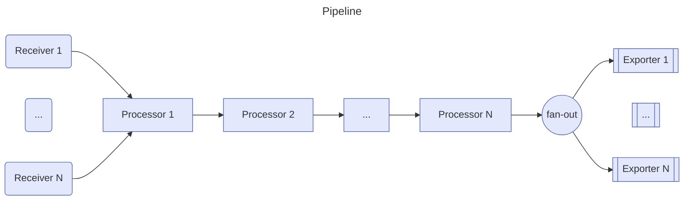

---
# You can also start simply with 'default'
theme: seriph
# random image from a curated Unsplash collection by Anthony
# like them? see https://unsplash.com/collections/94734566/slidev
background: https://www.drupal.org/files/project-images/opentelemetry-logo_0.png
# some information about your slides (markdown enabled)
title: OpenTelemetry
info: |
  ## OpenTelemetry fondamentals
  Presentation slides for developers.

# apply unocss classes to the current slide
class: text-center
# https://sli.dev/features/drawing
drawings:
  persist: false
# slide transition: https://sli.dev/guide/animations.html#slide-transitions
transition: slide-left
# enable MDC Syntax: https://sli.dev/features/mdc
mdc: true
hideInToc: true
---

---
transition: fade-out
layout: image
hideInToc: true
image: /images/welcome-sparks.png
---

<Onea class="absolute left-10 bottom-5"/>

---
transition: fade-out
layout: image
hideInToc: true
image: /images/intro-sparks.png
backgroundSize: contain
---

---
layoutClass: gap-16
hideInToc: true
---

# Sommaire

<Toc columns="4" max-depth="2" />


---
transition: fade-out
---

# Fil rouge 
Quelques éléments clefs

<h3 class="mb-2">Objectif: Mettre en place une solution d'observabilité pour une application distribuée.</h3>
 
Mise en avant de l'importance de la <b>corrélation</b> de données.  

Construction d'un tableau de board de supervision utilisant les <b>indicateurs RED</b> (Rate, Error, Duration).

<h3>Une application distribuée simple</h3>

Périmètre fonctionnel : une application qui retourne des unités de transport, avec un un voyage associé.
   
- Une <b>API Front</b> en .Net  
- Une <b>API Business</b> en .Net  
- Une <b>base de données SQLite</b> qui stocke les unités de transport.  


<Onea class="absolute left-10 bottom-5"/>

---
transition: fade-out
hideInToc: true
---
# Fil rouge 
Quelques éléments clés

<h3> Utilisation de la pile OpenTelemetry </h3>

Protocole OTLP pour la communication  
Instrumentation automatique et manuelle   
Collecteur OTEL  
   
Un backend de visualisation basée sur la pile LGTM (Loki, Grafana, Tempo, Mimir)
  - Loki pour la gestion des logs 
  - Tempo pour la gestion des traces.
  - Mimir pour la gestion des métriques.
  - Grafana pour la visualisation des données.


---
transition: fade-out
image: /images/demo.collecte.drawio.png
backgroundSize: 80%
layout: image
hideInToc: true
---
<p class="absolute right-5 top-5 text-3xl"> Fil rouge </p> 

<!--
Démo
-->

---
Transition: fade-out
---
# Introduction à l'observabilité


<Onea class="absolute left-10 bottom-5"/>

<!--
Compréhension approfondie et détaillée
Amélioration continue
-->

---
transition: fade-out
level: 2
---
#  Définition
<p class="absolute right-5 top-5 text-3xl"> Observabilité </p> 

L'observabilité nous permet de comprendre l'état et le fonctionnement d'un système complexe en se basant sur ses entrées et ses sorties <b>externes</b>, telles que les <b>journaux</b>, les <b>métriques</b> et les <b>traces</b>.

<div class="flex justify-center  mx-auto mt-8 text-3xl">
  <blockquote class="w-3/4 mt-8">
    <p class="text-2xl p-4 !leading-8 bg-white">
      A system is <b>observable</b>
      if the <b>behaviour</b> of
      the entire system can
      be determined by only
      looking at its <b>inputs
      and outputs</b>*.
    </p>
  </blockquote>
</div>

<br />
*Rudolf Emil Kálmán (1961), On the General Theory of Control Systems

<Onea class="absolute left-10 bottom-5"/>

---
image: /images/signaux.jpg
transition: fade-out
layout: image
backgroundSize: contain
level: 2
---
#  Les signaux
<p class="absolute right-5 top-5 text-3xl"> Observabilité </p> 

  

---
layout: image-right
image: /images/observability-personas.png
transition: fade-out
backgroundSize: contain
level: 2
---

# Quels acteurs ?
<p class="absolute right-5 top-5 text-3xl"> Observabilité </p>
  
  <ul>
    <li>Les équipes <b>support</b>, pour la résolution des problèmes de production </li>
    <li>Les équipes <b>développement</b>, pour le suivi des bugs et des améliorations</li>
    <li>Les <b>responsables métier</b>, pour superviser un périmètre applicatif</li>
    <li>Les <b>administrateurs système</b>, pour s'assurer du bon fonctionnement de l'infrastructure</li>
    <li>Les <b>clients</b>, pour suivre leur signal au travers des services Fournis</li>
    </ul>

<Onea class="absolute left-10 bottom-5"/>


---
transition: fade-out
hideInToc: true
level: 2
---
#  Pourquoi l'Observabilité est-elle cruciale ?
<p class="absolute right-5 top-5 text-3xl"> Observabilité </p> 


## Complexité Croissante 
Les systèmes modernes sont de plus en plus <b>complexes</b> (microservices, architecture distribuée, cloud native, etc.)  

## Visibilité Holistique 
Permet une <b>vue d'ensemble des systèmes</b>, aidant à corréler les données et à identifier les causes profondes des problèmes

## Détection et Résolution Rapide des Problèmes  
Facilite la détection rapide et la résolution des anomalies, réduisant ainsi le <b>temps moyen de détection</b> (MTTD) et le <b>temps moyen de résolution</b> (MTTR)


---
transition: fade-out
level: 2
hideInToc: true
---
#  Pourquoi l'Observabilité est-elle cruciale ?
<p class="absolute right-5 top-5 text-3xl"> Observabilité </p> 

## Amélioration de la Fiabilité
Aide à concevoir des systèmes plus <b>résilients</b> en <b>identifiant</b> les points de défaillance et en permettant la mise en place de mécanismes de récupération appropriés

## Optimisation des Performances  
Permet d'identifier les <b>goulots d'étranglement</b> et d'optimiser les performances des systèmes.  

## Automatisation et IA
Peux être utilisée pour <b>automatiser</b> la surveillance et la gestion des systèmes, et pour alimenter des systèmes d'<b>IA</b>.


---
transition: fade-out
level: 2
---
#  Pourquoi l'Observabilité est-elle cruciale ?
<p class="absolute right-5 top-5 text-3xl"> Observabilité </p> 

## Surveillance Améliorée
Va au-delà de la simple surveillance en offrant une analyse <b>contextuelle</b> et une visualisation des anomalies

## Amélioration de la collaboration
Les outils d'observabilité fournissent un <b>langage commun</b> pour les équipes de <b>développement</b>, d'<b>exploitation et de support</b>, facilitant la collaboration et la résolution de problèmes.

## Support à l'évolutivité et l'innovation  
Simplifie le déploiement de nouvelles fonctionnalités et de nouveaux services, en fournissant une visibilité sur les performances et les interactions des systèmes.


---
transition: fade-out
hideInToc: true
level: 2
---
#  Zoom sur le traçage distribué
<p class="absolute right-5 top-5 text-3xl"> Observabilité </p>


---
transition: fade-out
level: 2
---
#  Zoom sur le traçage distribué
<p class="absolute right-5 top-5 text-3xl"> Observabilité </p>

Le traçage distribué est une technique d'observabilité qui permet de suivre le <b>cheminement</b> d'une <b>requête</b> à travers un système distribué, en enregistrant les <b>étapes</b> et les <b>temps</b> de traitement à chaque étape.

## Pourquoi le traçage est-il important ?
Le traçage permet de <b>comprendre</b> et de <b>diagnostiquer</b> les problèmes de performance et de fiabilité, en identifiant les <b>goulots d'étranglement</b> et les <b>points de défaillance</b> dans les systèmes distribués.

## Comment fonctionne le traçage ?
Le traçage est basé sur l'<b>instrumentation</b> des applications, qui enregistre des <b>données de contexte</b> à chaque étape du traitement, et sur la <b>corrélation</b> de ces données pour reconstituer le <b>parcours</b> de la requête.

> Notions clées : Spans, Trace Id


<!--
Span
Trace ID
-->

---
transition: fade-out
---
#  Présentation d'OpenTelemetry


<Onea class="absolute left-10 bottom-5"/>

---
transition: fade-out
level: 2
---
# Un peu d'histoire
<p class="absolute right-5 top-5 text-3xl"> OpenTelemetry </p> 

OpenTelemetry est un projet <b>open-source</b> collaboratif, initié par la Cloud Native Computing Foundation (<b>CNCF</b>)

## Fusion de OpenTracing et OpenCensus

<b>OpenTracing</b> fournissait une API standard pour le traçage distribué.  

<b>OpenCensus</b> offrait des bibliothèques pour la collecte de traces et de métriques.

En 2019, <b>OpenTelemetry</b> a fusionné ces deux projets pour créer une solution <b>unifiée</b> pour l'observabilité des systèmes distribués.

<Onea class="absolute left-10 bottom-5"/>

---
transition: fade-out
level: 2
---
# Quelques caractéristiques 
<p class="absolute right-5 top-5 text-3xl"> OpenTelemetry </p>

### Indépendant des fournisseurs (vendor-neutral)
OpenTelemetry est un projet <b>open-source</b> et <b>indépendant des fournisseurs</b>, ce qui signifie qu'il peut être utilisé avec n'importe quelle technologie ou plateforme.

### Standardisé et unifié
OpenTelemetry fournit un ensemble de composants : des spécifications, un prococol de transport (OTLP), des conventions de nommage, des SDKs, un collecteur et d'autres outils  variés (pour K8s, FaaS , ...)   
Combiner les <b>traces</b>, les <b>métriques</b> et les <b>logs</b> simplifie la configuration de l'observabilité.

### Extensible
OpenTelemetry est conçu pour être <b>extensible</b> et <b>modulaire</b>, permettant aux utilisateurs de personnaliser et d'étendre les fonctionnalités selon leurs besoins.

<Onea class="absolute left-10 bottom-5"/>

<!--
Interopérabilité
Communauté et Support
Facilite la migration entre différentes solutions d'observabilité
-->

---
transition: fade-out
level: 2
---
# Le contexte de propagation
<p class="absolute right-5 top-5 text-3xl"> OpenTelemetry </p>

Mécanisme utilisé pour transmettre des informations contextuelles (traceId, spanId, ...) à travers les frontières des processus et des réseaux.

> Cette notion est essentielles pour le traçage distribué et la corrélation des signaux.

<br />

### Fonctionnement
- <b>Génération</b>: Un nouveau contexte est généré au début d'une requête (un trace ID et un span ID ...).
- <b>Inejction</b>: Ce contexte est injecté dans les en-têtes des requêtes HTTP ou des messages RPC pour être transmis aux services en aval.
- <b>Extraction</b>: Les services récepteurs extraient le contexte des en-têtes pour continuer la trace.
- <b>Transmission</b>: Les informations de contexte sont propagées tout au long de la chaîne de services, permettant un suivi continu.

<Onea class="absolute left-10 bottom-5"/>

---
transition: fade-out
level: 2
hideInToc: true
---
# Le contexte de propagation
<p class="absolute right-5 top-5 text-3xl"> OpenTelemetry </p>

### Propagateurs
Les propagateurs permettent à chaque service d'une chaîne distribuée de lire et d'écrire les données du contexte et de les propager 

Propagateurs maintenus par OpenTelemetry :
- <b>[W3C TraceContext](https://www.w3.org/TR/trace-context)</b>: Standard pour la propagation du contexte de trace
- <b>[W3C Baggage](https://www.w3.org/TR/baggage)</b>: Permet de transmettre des données contextuelles supplémentaires
- <b>[B3](https://github.com/openzipkin/b3-propagation)</b>: Format de propagation de trace utilisé par Zipkin
- <b>[Jaeger](https://www.jaegertracing.io/docs/latest/client-libraries/#propagation-format)</b>: Format de propagation de trace utilisé par Jaeger

<br />

### Zoom : Baggage
Les bagages permettent de transmettre des données contextuelles supplémentaires, telles que des informations de <b>corrélation</b>, des <b>identifiants</b> de session, des <b>informations de sécurité</b>, etc.

[W3C Baggage](https://www.w3.org/TR/baggage)

---
transition: fade-out
level: 2
---
# Les autres concepts fondamentaux
<p class="absolute right-5 top-5 text-3xl"> OpenTelemetry </p>

### Les 3 signaux  

- <b>Trace</b>: Chemin parcouru par une requète
- <b>Métrique</b>: Mesure capturée à l'exécution
- <b>Log</b>: Enregistrement d'un événement 


### Instrumentation  
OpenTelemtry offre la possibilité d'instrumenter le code pour capturer ces signaux, avec une approche zero-code, automatique ou manuelle. 

### Collecteur  
Le collecteur permet de recevoir les signaux, les transformer et les exporter vers un backend comptabile

### Et aussi
SDKs, ressources, baggage, Convention de nommage (Semanyic conventions), Sampling, ...

[Registre OpenTelemetry](https://opentelemetry.io/ecosystem/registry/)

---
transition: fade-out
---

# Instrumentation
L'instrumentation est un processus qui permet d'ajouter du code pour capturer les signaux (traces, métriques, logs) de l'application.

### Zero-Code
OpenTelemetry fournit des outils pour capturer automatiquement les signaux, sans nécessiter de modification du code de l'application.
> Utile pour les applications tierces ou les applications existantes.

### Par configuration  
OpenTelemetry fournit des SDKs pour les langages de programmation populaires, qui permettent d'instrumenter automatiquement les applications pour capturer les signaux.

### Manuelle  
OpenTelemetry permet également d'instrumenter manuellement les applications, en ajoutant des points d'instrumentation personnalisés pour capturer des signaux spécifiques.

---
transition: fade-out
level: 2
---

# Les ressources
<p class="absolute right-5 top-5 text-3xl"> Instrumentation </p>

Entité produisant des signaux  
Ex: un service, une application, un conteneur, une machine virtuelle, )

<div class="flex justify-center  mx-auto mt-2 text-3xl">
  <blockquote class="w-3/4 my-4">
    <p class="text-xl p-4 !leading-6">
    La notion de ressource est un élement clé pour l'observabilité. Elle permet de <b>corréler</b> les signaux entre eux et de les <b>associer</b> à des <b>entités</b> du système.
    </p>
  </blockquote>
</div>

### Détection automatique
OpenTelemetry fournit des mécanismes pour détecter <b>automatiquement</b> les ressources, telles que les services, les applications, les conteneurs, les machines virtuelles, etc.

### Personnalisation
OpenTelemetry permet également de <b>personnaliser</b> les ressources, en ajoutant des <b>attributs</b> pour identifier et catégoriser les entités.


---
transition: fade-out
level: 2
hideInToc: true
---
# Les ressourses
<p class="absolute right-5 top-5 text-3xl"> Instrumentation </p>

### Attributs Clés
- <b>service.name</b>: Nom du service
- <b>service.version</b>: Version du service
- <b>service.instance.id</b>: Identifiant de l'instance du service
- <b>service.namespace</b>: Espace de nom du service. 
  > Util pour cartographier le système
- <b>environment.name</b>: Envirronement d'exécution du service (Development, production ...)

<br/>  

### Autres resources importantes (Semantic Conventions 1.26.0): 

- [Host](https://opentelemetry.io/docs/specs/semconv/resource/host/) 
- [Operating System](https://opentelemetry.io/docs/specs/semconv/resource/os/)
- [Process](https://opentelemetry.io/docs/specs/semconv/resource/process/)
- [Telemtry SDK](https://opentelemetry.io/docs/specs/semconv/resource/#telemetry-sdk)

---
transition: fade-out
level: 2
---

# Les Exportateurs 
<p class="absolute right-5 top-5 text-3xl"> Instrumentation </p>

Envoient les données collectées au collecteur OpenTelemtry (ou directement au backend)

Il existe différents types d'exportateurs, par exemple : 
- <b>Console</b> : Pour afficher les données de télémétrie dans la console
- <b>OTLP</b> : Utilise le protocole OpenTelemetry pour exporter les données
- <b>Zipkin</b> : Pour exporter les traces vers Zipkin
- <b>Jaeger</b> : Pour exporter les traces vers Jaeger
- <b>Prometheus</b> : Pour exporter les métriques vers Prometheus

<br />

> Dans certains cas, l'exportateur est préconfiguré pour un backend spécifique.

<Onea class="absolute left-10 bottom-5"/>


---
transition: fade-out
layout: image
image: /images/logging.png
backgroundSize: contain
---
# Les signaux : Logs

<Onea class="absolute left-10 bottom-5"/>

<!--
Au coeur de l'observabilité.
-->

---
transition: fade-out
layout: image-right
image: /images/logs-without-opentelemetry.png
backgroundSize: contain
level: 2
---
# Sans OpenTelemetry
<p class="absolute right-5 top-3 text-3xl"> Les Logs </p>

- Faible intégration avec les traces et métriques
- Manque de standardisation pour inclure les informations sur l'origine des logs
- Absence de propagation du contexte d'exécution

<Onea class="absolute left-10 bottom-5"/>

---
transition: fade-out
layout: image-right
image: /images/logs-with-opentelemetry.png
backgroundSize: contain
level: 2
---
# Avec OpenTelemetry
<p class="absolute right-5 top-3 text-3xl"> Les Logs </p>

- Standardisation de la corrélation des logs avec les traces et métriques
- Ajout du support de la propagation du contexte distribué
- Unification pour tous les logs

<Onea class="absolute left-10 bottom-5"/>

---
transition: fade-out
level: 2
---
# Modèle de données et mapping
<p class="absolute right-5 top-5 text-3xl"> Les Logs </p>

### Elements clés
- Timestamp / ObservedTimestamp
- Severité (SeverityText, SeverityNumber) : WARN, ERROR, etc.
- Corps du message (Body)
- Ressource (Resource) 
- Attributs, métadonnées (Attributes) 
- Trace Context Fields (TraceId, SpanId, TraceFlags) pour la corrélation

[Modèle de données](https://opentelemetry.io/docs/specs/otel/logs/data-model)

<br />

### Mapping
Il existe un tableau de correspondance pour mapper les attributs des solutions existantes (log4j, Windows events, Elastic Common Schema, ...)

[Exemple de mapping](https://opentelemetry.io/docs/specs/otel/logs/data-model-appendix/#appendix-a-example-mappings)

---
transition: fade-out
level: 2
---
# Architecture de collecte
<p class="absolute right-5 top-5 text-3xl"> Les Logs </p>

Selon les besoins, il existe plusieurs archiectures possibles pour la collecte des logs, par exemple :
- <b>Collecteur OTEl</b> : Le collecteur openTelemetry lit les logs stockés dans un conteneur auxiliaire.  
- <b>Agent + Collecteur</b> : Un processus en arrière-plan lit les logs et les pousse et les envoie à un collecteur
- <b>SDK</b> : Une bibliothèque intégrée à l'application pour capturer les logs et les envoyer à un collecteur


---
transition: fade-out
---
# Le protocole OTLP

Protocole de transport standardisé, conçu pour être <b>indépendant du langage et de la plateforme</b>.

### Caractéristiques Principales
- <b>Format de données</b> : Utilise Protocol Buffers pour la sérialisation
- <b>Transport</b> : Supporte gRPC et HTTP 1.1

<br />

### GRPC
- Haute performance, streaming (bidirectionnel)
- Port par défaut : 4317

### HTTP
- Utilise des requètes POST
- Port par défaut : 4318
- Encodages: Binary Protobuf et JSON Protobuf


---
transition: fade-out
hideInToc: true
---
# Le protocole OTLP

### Sécurité
Le protocole OTLP ne précice pas de mécanisme d'authentification et de sécurisation. Il s'appuie sur les mécanismes de sécurité sous-jacents (TLS, mTLS, JWT, ...)


### Quelques avanatages 
- <b>Standardisation</b> : Format unifié pour tous les types de télémétrie
- <b>Efficacité</b> : Optimisé pour la performance et la faible utilisation de bande passante
- <b>Extensibilité</b> : Facilement extensible pour de nouveaux types de données

### Implémentation
- <b>Côté Client</b> : SDKs OpenTelemetry dans différents langages
- <b>Côté Serveur</b> : Collecteurs OpenTelemetry, backends compatibles OTLP

[OTLP Specifications](https://opentelemetry.io/docs/specs/otlp/#protocol-details)

<!-- 
- HTTP Compatible avec plus d'environnements
-->

---
transition: fade-out
image: /images/otel-collector.svg
layout: image
backgroundSize: 65%
hideInToc: true
---

# Le collecteur OpenTelemetry

<Onea class="absolute left-10 bottom-5"/>

---
transition: fade-out

---

# Le collecteur OpenTelemetry
 Composant central de l'architecture OpenTelemetry

<br />

### Fonctions principales
- <b>Collecte</b> de données de multiples sources
- <b>Traitement et transformation</b> des données
- <b>Exportation</b> vers divers backends d'observabilité  

<br />

### Avantages
- <b>Centralisation</b> de la gestion des données de télémétrie
- Réduction de la charge sur les applications instrumentées
- Flexibilité et <b>extensibilité</b>

<Onea class="absolute left-10 bottom-5"/>

---
transition: fade-out
level: 2
---

# Configuration
<p class="absolute right-5 top-5 text-3xl"> Collecteur </p>

Le collecteur OpenTelemetry est configuré à l'aide d'un fichier de configuration YAML, qui définit les pipelines de collecte de données.

### Exemple de configuration
```yaml
receivers:
  otlp:
    protocols:
      grpc:
processors:
  batch:
exporters:
  otlp:
    endpoint: backend:4317
service:
  pipelines:
    traces:
      receivers: [otlp]
      processors: [batch]
      exporters: [otlp]
```


---
transition: fade-out
level: 2
---

# Déploiement
<p class="absolute right-5 top-5 text-3xl"> Collecteur </p>

Le collecteur OpenTelemetry peut être déployé de différentes manières, selon les besoins et les contraintes de l'environnement.

- <b>No Agent</b> : L'application envoie les données directement au backend 
  - Simple et léger
- <b>Agent</b> : Déployé sur chaque hôte
  - Mapping 1 <-> 1 
- <b>Gateway</b> : Déployé comme un service centralisé
  - Résilient et évolutif
- <b>Sidecar</b> : Déployé aux côtés de chaque application (dans Kubernetes)
  - Isolation et indépendance

<Onea class="absolute left-10 bottom-5"/>

---
transition: fade-out
hideInToc: true
level: 2 
---

# Pipelines
<p class="absolute right-5 top-5 text-3xl"> Collecteur </p>

L'architecteure du collecteur OpenTelemetry est basée sur un modèle de pipeline, qui comprend plusieurs type de composants :
- <b>Recepteur</b> : Lit les données de télémétrie à partir de différentes sources
- <b>Processeur</b> : Traite et transforme les données
- <b>Exportateur</b> : Envoie les données vers un backend d'observabilité



<!--
Recepteur, push or pull
-->

---
transition: fade-out
level: 2
---

# Pipelines
<p class="absolute right-5 top-5 text-3xl"> Collecteur </p>

Exemple de  configuration YAML pour un pipeline de traces :

```yaml	
service:
  pipelines: # section that can contain multiple subsections, one per pipeline
    traces: # type of the pipeline
      receivers: [otlp, zipkin]
      processors: [memory_limiter, batch]
      exporters: [otlp, zipkin]
    traces/2: # another pipeline of “traces” type
      receivers: [otlp]
      processors: [batch]
      exporters: [otlp]
```

<br />

### Tips
La sortie d'un pipeline peut être utilisée comme entrée d'un autre pipeline, permettant de créer des pipelines complexes et modulaires.  
> <b>spanmetrics</b> connector: Un pipeline de traces peut alimenter un pipeline de métriques.

---
transition: fade-out
level: 2
---

# Récepteurs
<p class="absolute right-5 top-5 text-3xl"> Collecteur </p>

Les recepteurs sont responsable de la collecte des données de télémétrie à partir de différentes sources.

### Type de Récepteurs
Il existe plusieurs types de récepteurs, selon les distribution. Par exemple : HTTP, gRPC, Jaeger, Prometheus, Zipkin, etc.

### Ecoute passive
Généralement, les récepteurs écoute un port spécifique pour recevoir les données de télémétrie.  
Ex : otlp

### Récupération active
Certains récepteurs récupèrent activement les données de télémétrie à partir de sources externes, telles que les fichiers de logs, les bases de données, les files d'attente, etc.  
Exemple : journald, filelog


---
transition: fade-out
level: 2
---

# Exportateurs
<p class="absolute right-5 top-5 text-3xl"> Collecteur </p>

Ils sont chargés d'envoyer les données de télémétrie vers un backend d'observabilité.

### Types d'exportateurs
Il existe plusieurs types d'exportateurs, selon les besoins. Par exemple : OTLP, Zipkin, Jaeger, Prometheus, etc.

```yaml	
exporters:
  # Data sources: traces, metrics, logs
  file:
    path: ./filename.json

  # Data sources: traces, metrics, logs
  otlp:
    endpoint: otelcol2:4317
    tls:
      cert_file: cert.pem
      key_file: cert-key.pem
 
  # Data sources: traces, metrics, logs
  debug:
    verbosity: detailed
```

<!--
Possibilité d'avoir deux exporter du meme type avec des configurations différentes
exporters:
  otlp/1:
    endpoint: example.com:4317
  otlp/2:
    endpoint: localhost:14317
-->


---
transition: fade-out
level: 2
---

# Processeurs
<p class="absolute right-5 top-5 text-3xl"> Collecteur </p>

Les processeurs sont responsables du traitement et de la transformation des données de télémétrie.

### Fontionnement
L'ordre des processeurs est important, chaque processeur traite les données de télémétrie dans l'ordre spécifié.  
Les données en sotrie d'un processeur sont utilisées comme entrée pour le processeur suivant


### Processeurs recommandés
1.  <b> Memory Limiter</b>: Limite la mémoire utilisée par le collecteur
2.  <b> Sampling / Filtering </b>: Permet de réduire le volume de données collectées 
3.  <b> Traitement basé sur le contexte </b>: Permet de traiter les données en fonction du contexte (ex: k8sattributes)
4.  <b> Batch </b>: Regroupe les données de télémétrie en lots pour l'exportation
5.  <b> Autres processeurs </b>: Ex: Span processor, ...

<Onea class="absolute left-10 bottom-5"/>

---
transition: fade-out
level: 2
hideInToc: true
---

# Processeurs
<p class="absolute right-5 top-5 text-3xl"> Collecteur </p>

```yaml	
processors:
  # Data sources: traces
  attributes:
    actions:
      - key: db.statement
        action: delete
      - key: email
        action: hash
  # Data sources: traces, metrics, logs
  batch:
  # Data sources: traces, metrics, logs
  memory_limiter:
    check_interval: 5s
    limit_mib: 4000
    spike_limit_mib: 500

...
service:
  extensions: []
  pipelines:
    traces:
      receivers: [otlp]
      processors: [memory_limiter, batch, attributes]
      exporters: [otlp]
```

<!--
Selon l'avancement, possibilité de jouer avec les filtres
-->

---
transition: fade-out
layout: image
image: /images/lgtm.jpeg
hideInToc: true
backgroundSize: 75%
---

# OpenTelemetry backend

<Onea class="absolute left-10 bottom-5"/>

---
transition: fade-out
layout: image-right
image: /images/grafana-dashboard.png
---

# LGTM stack

### Loki
Système de gestion de logs

### Grafana
Tableau de bord pour la visualisation des données de télémétrie

### Tempo
Système de gestion de traces

### Mimir
Système de gestion de métriques


---
transition: fade-out
hideInToc: true
layout: image-left
image: /images/k6-icon.svg
backgroundSize: 50%
---

# Grafana K6

Grafana k6 est une solution de <b>test de charge</b> et de performance <b>open-source</b>  
Grafana k6 permet de simuler des charges réalistes 

[Documentation](https://k6.io/docs/)

<Onea class="absolute left-10 bottom-5"/>

---
transition: fade-out
layout: image
image: /images/traces-spans.png
backgroundSize: 90%
---
# Les signaux : Traces
<p class="absolute right-5 top-5 text-3xl"> Les Signaux </p>

<Onea class="absolute left-10 bottom-5"/>


---
transition: fade-out
level: 2
---

# Modèle de données
<p class="absolute right-5 top-5 text-3xl"> Les Traces </p>

### SpanContext
Portion du span qui contient les données du contexte distribué ([W3C TraceContext](https://www.w3.org/TR/trace-context/)). On y retrouve : 
- <b>TraceID</b> : Identifiant unique de la trace
- <b>SpanID</b> : Identifiant unique du span
- TraceFlags : Drapeaux de trace. (1 seul supporté : `sampled`)
- TraceState : Etat de la trace ()
- IsRemote : Indique si le span est un span distant

<br />

### Autres informations 
Chaque span contient également des informations sur le <b>nom</b>, la <b>durée</b>, le <b>début</b>, la <b>fin</b>, les <b>attributs</b>, les <b>événements</b>, les <b>liens</b>.

---
transition: fade-out
level: 2
---

# Instrumentation: Trace API

### Trace Provider
Fournit une instance de <b>Tracer</b> pour la création de traces. 

### Tracer
Interface pour la création de traces (Spans)

### Trace Exporters
Exporte les traces vers un collecteur ou un backend d'observabilité.

### Contexte Propagation
Méchanisme pour transmettre les informations de contexte à travers les frontières des processus et des réseaux.


---
transition: fade-out
image: /images/metrics-graphic.jpg
layout: image
backgroundSize: 90%
hideInToc: true
---
# Les signaux : Métriques


---
transition: fade-out
---
# Les signaux : Métriques
<p class="absolute right-5 top-5 text-3xl"> Les Métriques </p>


## Qu’est ce qu’une métrique ?

<b>Mesures</b> quantitatives qui fournissent des informations sur l'état et la performance d'un système

| <b>timestamp</b> | <b>value</b> | <b>htt_response_status_code</b> | <b>http_request_method</b> |
|-----------|-------|--------------------------|---------------------|
| <span class="text-gray">10</span> | <span class="text-gray">10</span>    | 200                      | GET                 |
| <span class="text-gray">10</span> | <span class="text-gray">2</span>     | 500                      | GET                 |
| <span class="text-gray">15</span> | <span class="text-gray">32</span>    | 200                      | GET                 |

<span class="text-3xl font-bold"> Metric = Timestamp + Valeur + Dimensions (Labels) </span> 

---
transition: fade-out
level: 2
hideInToc: true
layout: image
image: /images/metric_json.png
backgroundSize: contain
---


--- 
transition: fade-out
level: 2
--- 

# Types de métriques OpenTelemetry
- <b>Compteurs</b> : Mesure incrémentale (ex: nb de requetes traitées)
  - Suffixe courant : `_total`
- <b>Jauges</b> : Mesure instantanée (ex: Utilisation de la memoire)
  - Suffixe courant : `_sum`, `_count`
- <b>Histogrammes</b> : Distribution des valeurs (ex: Durée des requetes)
  - Répartition des valeurs dans des plages spécifiques (buckets)
  - Suffixe courant : `_bucket`, `_sum`, `_count`

<br />  

<!--
- Pas de Summary (Prometheus)
- Pas de stockage dans Prometheus du type de métrique
- Asynchrone : La valeur est mise à jour de manière asynchrone : indépendamment du cycle de collecte principal (ex: par un evenement)
- Conventions de nommage : https://prometheus.io/docs/practices/naming/

-->

---
transition: fade-out
level: 2
---

# Instrumentation : synchrone et asynchrone
<p class="absolute right-5 top-5 text-3xl"> Les Métriques </p>

### Instrumentation synchrone
- Collecte à <b>interval régulier</b>
- Impact régulier et prévisible sur les performances
- Vue régulière et cohérente dans le temps
- Exemple : Nombre de reqêtes par seconde, CPU ...  

<br />

### Instrumentation asynchrone
- Collecte basée sur des <b>événements</b>, indépendamment du cycle de collecte principal.
- Impacte plus faible sur les performances, mais irrégulier.
- Utile pour les mesures qui changent moins fréquemment, et qui sont coûteuses à collecter.
- Exemple : Taille d'une file d'attente de message

<!-- 
On se concentre sur Synchrone
-->

---
transition: fade-out
level: 2
---

# Instrumentation : Metrics API
<p class="absolute right-5 top-5 text-3xl"> Les Métriques </p>

## Meter Provider
Fournit une instance de <b>Meter</b> pour la création de métriques.

## Meter
Interface pour la création de métriques (Metric Instruments).

## Metric Instrument
Il enregistre les valeurs des métriques.
Ex: Counter, UpDownCounter, Gauge, Histogram

## Metric Exporter
Exporte les métriques vers un collecteur ou un backend d'observabilité.

---
transition: fade-out
level: 2
layout: image
image: /images/model-event-layer.png
backgroundSize: contain
---

<span class="absolute bottom-5 left-5 text-xl text-black">Spécifications + Conventions de nommage = Données de métriques pré-agrégées 
</span>


---
transition: fade-out
layout: two-cols
level: 2
---

<p class="absolute right-5 top-5 text-3xl "> Les Métriques </p>

# PromQL

### Labels / Filtres
Equivalent à une clause 'where'

```
http_requests_total{method="POST", handler="/api/traces"}
```

### By
Equivalent à un group by

```
sum(http_requests_total) by (method)
```

### Range Vector
Sélectionne les données sur une période donnée

```
http_requests_total[5m]
```

::right::

### Rate
Calcul du taux de variation par seconde

```
rate(http_requests_total[5m])
```

### Opérateurs mathématiques
+, -, *, /, %, ^
```
http_requests_total{method="POST"} +  
  http_requests_total{method="GET"}
```
### Fonctions d'aggération
sum(), count(), avg(), min(), max(), ...

```
sum(http_requests_total) by (method)
```

<!--

Sotckage des données : clé(label)/timestamp/valeur
 Le type de métrique n'est pas stocké dans Prometheus !
-->

---
transition: fade-out
level: 2
---

# Des métriques à partir des traces

Les métriques et les traces sont complémentaires.
Alors que les métriques offrent une vue synthétique de l'ensemble, les traces permettent d'avoir une vue détaillée d'une requête unique.

### OTEL Collector spanmetrics
Le collecteur OpenTelemetry propose un composant spanmetrics qui permet de générer des métriques à partir des traces.

### Quels avantages ? 
- <b>Economie de ressources</b> : Réduit la charge sur les applications !
- <b>Précision</b> : Les métriques sont basées sur des données de traces réelles
- <b>Flexibilité</b> : Possibilité de créer des métriques personnalisées
- <b>Corrélation</b> : Les métriques sont corrélées avec les traces

<p class="absolute right-5 top-5 text-3xl"> Les Métriques </p>

---
transition: fade-out
level: 2
hideInToc: true
layout: image
image: /images/poc.collector.drawio.png
backgroundSize: 80%
---


---
transition: fade-out
level: 2
---

# La méthode RED  

- <b>Rate</b> : Nombre de requêtes par seconde
- <b>Error</b> : Nombre de ces requêtes en erreur
- <b>Duration</b> : Durée moyenne de traitement de ces requêtes


### Pourquoi la méthode RED ?
- <b>Simple</b> : Facile à comprendre et à mettre en oeuvre
- <b>Universelle</b> : Applicable à tous les types de services
- <b>Complémentaire</b> : Combinée avec les traces, elle fournit une vue complète de la performance


### Autres méthodes
- <b>USE</b> : Utilisation, Saturation, Erreurs
- <b>Four Golden Signals</b> : Traffic, Errors, Saturation, Latency


<p class="absolute right-5 top-5 text-3xl"> Les Métriques </p>

---
transition: fade-out
level: 2
hideInToc: true
layout: image
image: /images/red_formula.png
backgroundSize: contain
---
